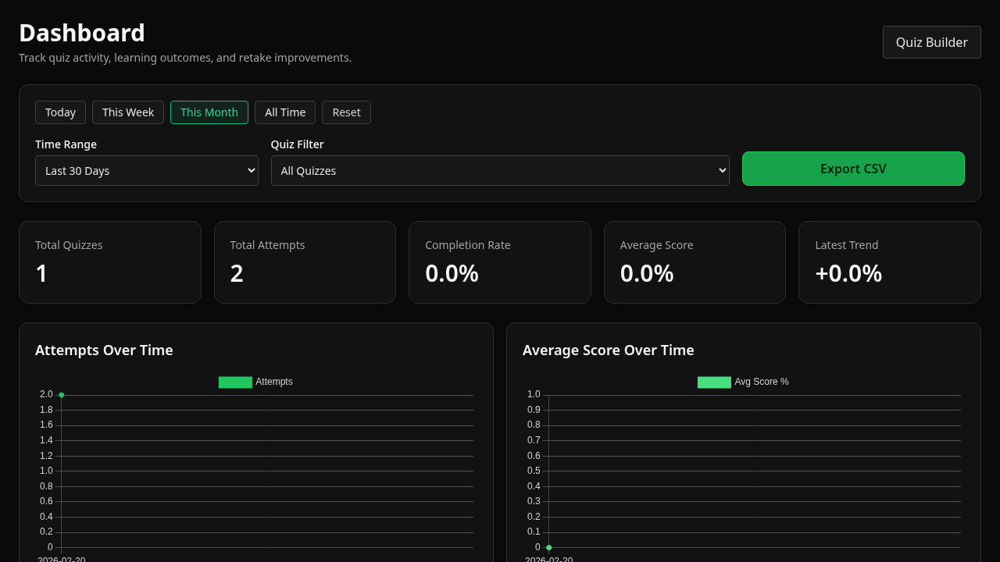

# QuizForge

A full-stack quiz platform that turns markdown files and YouTube transcripts into mixed-format quizzes, tracks learner performance, and surfaces weak areas for targeted practice.



## What This Project Does

- Ingests learning sources from uploaded markdown files and YouTube URLs.
- Generates quizzes with a mix of multiple-choice and open-ended questions.
- Grades answers, including rubric-based open-ended evaluation.
- Provides in-quiz AI chat support tied to the learner's current question context.
- Tracks attempts and scores over time with a dashboard and charts.
- Creates "trouble quizzes" from previously missed questions.

## Tech Stack

- **Backend:** Node.js, TypeScript, Express
- **Frontend:** Alpine.js, Tailwind CSS, Chart.js
- **Database:** SQLite via Prisma ORM
- **Testing:** Vitest + Supertest
- **LLM Integration:** OpenAI-compatible chat completions API (configurable base URL/model)
- **YouTube Transcript Fetching:** `yt-dlp`

## Project Structure

```text
src/
  server/
    app.ts                  # Express routes
    index.ts                # Server bootstrap
    db.ts                   # Prisma client
    services/               # Quiz generation, analytics, grading, chat, ingestion
  web/
    pages/                  # HTML pages (builder, quiz, results, dashboard)
    assets/                 # JS/CSS and screenshot asset
prisma/
  schema.prisma             # SQLite schema
tests/                      # Unit/integration tests
```

## Core User Flow

1. Open **Quiz Builder** (`/builder`) or **Dashboard** (`/dashboard`).
2. Add sources:
   - Upload markdown files, and/or
   - Provide YouTube URLs.
3. Generate a quiz from ingested sources.
4. Take quiz attempts and get immediate feedback.
5. Review results and analytics in the dashboard.
6. Launch targeted "trouble questions" practice from weak areas.

## Prerequisites

- Node.js 20+ (project currently runs with newer versions too)
- npm
- `yt-dlp` installed and available on PATH (required for YouTube transcript ingestion)

## Quick Start

```bash
npm install
cp .env.example .env
npm run prisma:generate
npm run prisma:push
npm run tailwind:build
npm run dev
```

Open: `http://localhost:3000/dashboard`

### One-command startup script

You can also run:

```bash
./start.sh
```

This script installs dependencies (if missing), prepares `.env`, runs Prisma/Tailwind setup, and starts the dev server.

## Environment Variables

Configured in `.env`:

- `PORT` - server port (default `3000`)
- `DATABASE_URL` - Prisma database connection string (SQLite by default)
- `OPENAI_API_KEY` - required unless mock mode is enabled
- `OPENAI_BASE_URL` - API base URL (supports OpenAI-compatible providers)
- `OPENAI_MODEL` - model name used for generation/grading/chat
- `MOCK_LLM` - optional; set `1` to use fallback/mock generation paths for local testing

## Use GPT-OSS 120B via Groq Free Tier

This app supports OpenAI-compatible endpoints, so you can run it against [Groq](https://groq.com/).

1. Create a Groq account and generate an API key.
2. Update your `.env`:

```bash
OPENAI_API_KEY="gsk_your_groq_key_here"
OPENAI_BASE_URL="https://api.groq.com/openai/v1"
OPENAI_MODEL="openai/gpt-oss-120b"
```

3. Start the app normally (`npm run dev` or `./start.sh`).

Notes:

- Groq free tier availability, quotas, and rate limits can change.
- If you hit rate limits, retry after a short delay or temporarily use `MOCK_LLM=1`.
- The app already falls back from `json_schema` to `json_object` when provider/model support differs.

## Available Scripts

- `npm run dev` - run server in watch mode via `tsx`
- `npm run build` - build Tailwind + compile TypeScript
- `npm run start` - run compiled server from `dist/`
- `npm run prisma:generate` - generate Prisma client
- `npm run prisma:push` - sync schema to SQLite database
- `npm run tailwind:build` - compile and minify Tailwind CSS
- `npm test` - run test suite once
- `npm run test:watch` - run tests in watch mode

## Key Routes

### Pages

- `GET /dashboard` - analytics dashboard
- `GET /builder` - source ingestion + quiz generation
- `GET /quiz` - quiz-taking UI
- `GET /results` - attempt history for a quiz

### Core API

- `GET /health` - health check
- `POST /api/sources/ingest` - ingest markdown files + YouTube URLs
- `POST /api/quizzes/generate` - generate and persist a quiz
- `GET /api/quizzes` - list quiz catalog
- `GET /api/quizzes/:id` - quiz details/questions
- `DELETE /api/quizzes/:id` - delete quiz
- `POST /api/quizzes/:id/attempts` - start attempt
- `POST /api/attempts/:attemptId/answers` - submit answer
- `POST /api/attempts/:attemptId/chat` - contextual AI tutor/chat
- `POST /api/attempts/:attemptId/finish` - finish attempt and compute score
- `GET /api/quizzes/:id/attempts` - list attempts
- `GET /api/analytics/overview` - dashboard overview metrics/charts
- `GET /api/analytics/quizzes` - per-quiz analytics
- `GET /api/analytics/learning` - weak areas, accuracy, retake trends
- `GET /api/analytics/export.csv` - CSV export for attempts
- `POST /api/quizzes/custom/trouble` - generate weak-area practice quiz

## Testing

Run:

```bash
npm test
```

Current tests cover:

- API health and key route behavior
- Quiz generation helpers
- Analytics helper functions
- Quiz chat prompt/reply behavior
- Scoring/transcript-related services

## Notes on LLM and Provider Compatibility

- The app targets OpenAI chat completions with structured JSON output.
- If provider/model support for `json_schema` is limited, the code falls back to `json_object`.
- In offline/dev conditions, set `MOCK_LLM=1` to validate end-to-end app flow without a live model.

## Troubleshooting

- **`EADDRINUSE: 3000`**  
  Another process is already using the port. Change `PORT` or stop the existing process.

- **YouTube ingestion errors**  
  Ensure `yt-dlp` is installed and the target video has available captions/transcripts.

- **LLM authentication failures**  
  Verify `OPENAI_API_KEY`, `OPENAI_BASE_URL`, and `OPENAI_MODEL` values.

- **Prisma/database issues**  
  Re-run:
  - `npm run prisma:generate`
  - `npm run prisma:push`

## Security Reminder

- Do **not** commit real API keys or private `.env` values.
- Keep `.env` local and use `.env.example` for shared configuration templates.

